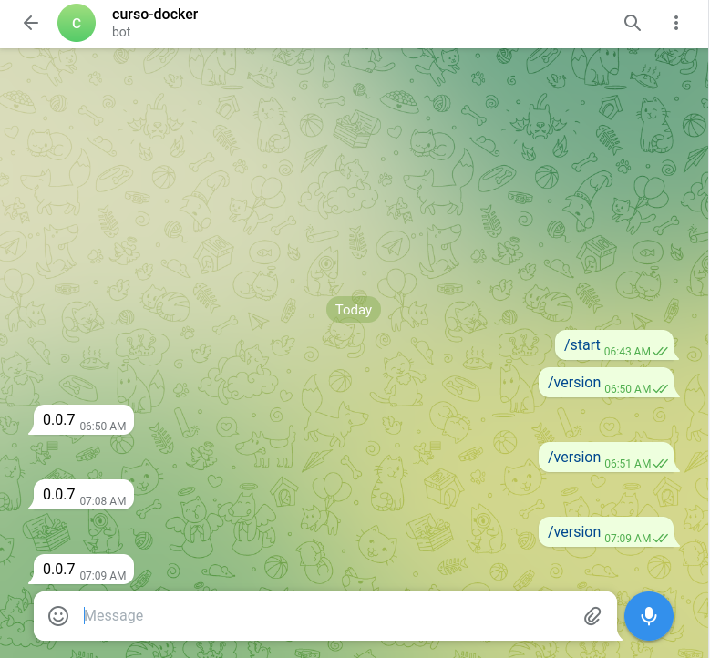

# Ejercicio 10

## Pasos realizados

1. Loguearse en Telegram y obtener un TOKEN para constuir un nuevo bot. Asignarle nombre al bot.

2. Probar localmente el bot corriendo un container con la imagen dada y asignando el TOKEN como variable de entorno.

```
docker run --env TELEGRAM_TOKEN=[TOKEN] nicopaez/telegrambot:0.0.7
```

3. Verificar que el bot funciona con el comando /version

4. Generar un archivo de deployment con la definición y la variable de entorno.

5. Ejecutar el deployment en minikube

```
kubectl apply -f deployment.yaml
```

6. Verificar el estado del pod y del deployment con kubectl y con minikube dashboard.

```
kubectl get pods
kubectl get deployments
```
## Bot funcionando

